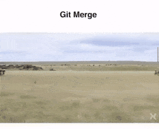

## Introdução ao git


### O que é o git

> Em 2005, Linus Torvalds  desenvolveu o GIT. Atualmente, o GIT é um dos mais famosos sistemas de controle de versão de código aberto e milhões de projetos no mundo inteiro o utilizam para seu controle de versão (incluindo projetos comerciais e de código aberto). 
>
>Um sistema de controle de versão distribuído, o GIT segue uma abordagem peer to peer, contrário de outros como o Subversion (SVN) que segue um modelo baseado em cliente-servidor.

### Instalando git
Debian  
sudo apt install git  
Fedora   
sudo dnf install git  
Window
[git download](https://git-scm.com/download/win) , e se vira, windows não é simples ^^?

Após instalado vamos configurar o git na nossa máquina.

 ```
 git config --global user.name "Xinforinfola"  
 git config --global user.email "exemplo@email.com.br"
 ``` 
 ### Começando um repositório
 Vamos criar uma pasta no nosso diretório de usuário chamada **curso-git**, dentro dela vamos criar a pasta **meu-projeto**.
 Dentro vamo criar o seguinte arquivo index.html
 
 ```
<!doctype html>
<html lang="en">
    <head>
      <meta charset="UTF-8">
      <meta name="viewport"
            content="width=device-width, user-scalable=no, initial-scale=1.0, maximum-scale=1.0, minimum-scale=1.0">
      <meta http-equiv="X-UA-Compatible" content="ie=edge">
      <title>Document</title>
    </head>
    <body>
      <p> Tanus é legal <p>
    </body>
</html>
  ```
 Bora dar uma olhada  no nosso projeto e iniciar o git:
  ```  
 git init  
 git status
  ```
 Nosso arquivo ainda nao está sendo monitorado pelo git. Para que isso aocnteça precisamos usar o comando:  
  ```
 git add . 
  ```
 Vamos olhar o git status agora.
 O arquivo agora está tracked pelo git, e pronto para ser versionado.
 vamo commitar a alteracao:
 ```
git commit -m'adicionado index.html no root'
```
> **A boa prática pede para colocarmos mensagens descritivas, evitando que fiquem muito grandes.**

Vamos adiconar mais um acento no Tanus

ok comitamos Tanús.


Vamos brincar um pouco agora com gitk , e git log. [git log documento](https://git-scm.com/book/pt-br/v1/Git-Essencial-Visualizando-o-Hist%C3%B3rico-de-Commits)

```
git log
git log -p
git log --oneline
git diff oldcommit...newcommit --name-only
git diff oldcommit...HEAD
```
um site legal pra brincar com as várias formas de extrair log
[git log cheatsheet](https://devhints.io/git-log)

### Ignorando arquivos

Sabe aqueles aruqivos merda que as ides criam, ou qualquer coisa que seja apenas uma config da sua maquina e você nao quer commitar ?  
Para isso vamo usar o aquivo .gitignore

vamos criar o aquivo hero-cfg.yml no root da nossa pasta:
```
tipo:
  hero:
    - tanus
    - superman
```
vamos dar um git status, veja o aqueivo aparece com untracked , mas não queremos isso. nao queremos que esse arquivo seja monitorado pelo git.
Para isso vamos criar o arquivo .gitignore na pasta root e adicionar o arquivo hero-cfg.yml
```
cat > .gitignore <<EOF
hero-cfg.yml
EOF
``` 
Usem git status agora.
Vamos commitar o .gitigonore

### Vamos falar um pouco sobre  boas praticas de commit ...
E pra isso nao existe definição apenas convensões.
- nunca commite algo interminado
- faça  pequenos commites.
- descreva o commit de forma sucinta
- vamos falar de equipe pra frente, mas sempre faz um 'pull' (chegaremos lá) antes de enviar para o servidor.
- pense que isso pode e vai dar problema e uma outra pessoa  vai precisar analizar...

## Repositórios remotos. Vamos trabalhar em equipe.
### Vamos criar nosso próprio repositório git. 

Vamos criar uma pasta chamada 'server' e dentro dela executar o comando: git init --bare
o comando --bare indica que essa pasta não irá receber alteração direta, será usado apenas como nosso  servidor.

Vamos agora dicionar  o servidor no nosso repositorio(execute na pasta meu-projeto) usando o comando:    
```git remote add origin /home/tux/Documents/curso-git/servidor```   
Use o comando 'pwd' para pegar  o caminho dentro da pasta server:

Vamos visualizar o servidor adicionado
```
git remote
git remote -v
```
Agora vamos executar o 'push', comando que vai enviar nossas alterações para o servidor:
```git push -u origin master```

Galera, vamos criar 2 pastas agora para simular 2 usuario na pasta em curso-git, vou usar o tanus e o dinamite.
entre nelas e execute: ```git clone  /home/tux/Documents/curso-git/servidor```

Vamos na pasta tanus adiciona um ```<p> Se é gente boa cara </p>``` no arquivo idex.html , fazer o push para o servidor, entrar na pasta dinamite e executar ```git pull origin master``` 

#### Vamos ver o gitk, a ferramenta visual do próprio git.
No windows acho que vem com o instalador, linux, se nao tiverem sudo apt ou dnf install gitk 

### Branches
Branches sao linhas de desenvolvimento  separadas, distintas, onde cada um pode seguir com seu fluxo de desenvolvimento se interferir no  trabalho dos outros amiguinhos.
Por exemplo, queremos trabalhar sem pegar o codigo que o Tanus esta fazendo pois sabemos que vai quebrar o front. kkk #ficaAdica

Vamos para  a pasta do dinamite e vamos criar a  branch da tarefa 001  
```git checkout -b dinamite-001```

o Tanus vai começar outra tarefa, vamos na pasta dele e  
```git checkout -b tanus-002```

**Agora vamos alterar um elemento no body com o dinamite e  quebrar o documento  no head com o tanus**

Após alterar, vamos commitar.

### Merge e Rebase
Para juntar os codigos de volta na master vamos usar uma funcao do git chamada merge,
 o merge vai criar um commit na frente da nossa branch master com as alterações.

na pasta do tanus 
```
git checkout master
git merger tanus-002
git push origin master
```
e vamos repetir agor no dinamite.

aqui temos um erro! ele acotnece porque o tanus já subiu as alterações e para que  o dinamite agora consiga subir as dele, primeiro ele precisa pegar essas alterações. fazendo:
``` git pull origin master ```

agora no tanus vamos pegar a altercao do dinamite

Existe  o rebase, vamos ver um pouco sobre ele e brincar no visualizer, ao contrário do merge 
que cria um commit a frente o reabase faz com que os commits de outra branch sejam incluidos na mesma posicao na master(atras) por exemplo ,mas  sinceramente não gosto
de usar com grandes times, pois vira um confusão da porra.


vamos ver o que aconteceu depois de commitar  com essa ferramenta: [visualizer](http://git-school.github.io/visualizing-git)  
simular o  que seria o rebase com ela.

### CONFLITOS!!!! !!!!!  
